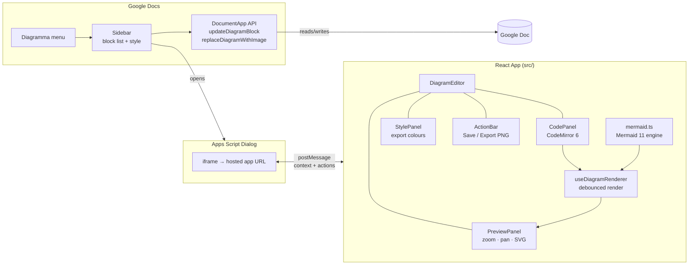
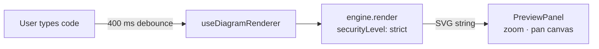
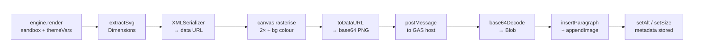

<div align="center">


# Diagramma

**Edit and render Mermaid diagrams without leaving Google Docs.**

Diagramma detects Mermaid code blocks in your document, opens a split-panel editor with live preview, and replaces the code block with a high-resolution PNG — keeping the original source intact so you can re-edit at any time.

</div>

---

## Table of Contents

- [What it does](#what-it-does)
- [Use cases](#use-cases)
- [How it works](#how-it-works)
- [Architecture](#architecture)
- [Project structure](#project-structure)
- [Getting started](#getting-started)
  - [Prerequisites](#prerequisites)
  - [Local development](#local-development)
  - [Deploying the React app](#deploying-the-react-app)
  - [Deploying the Google Apps Script add-on](#deploying-the-google-apps-script-add-on)
- [Diagram editor features](#diagram-editor-features)
- [Rendering pipeline](#rendering-pipeline)
- [Metadata and round-tripping](#metadata-and-round-tripping)
- [Adding a new diagram engine](#adding-a-new-diagram-engine)
- [Scripts reference](#scripts-reference)
- [License](#license)

---

## What it does

Most technical writers, engineers, and PMs use Mermaid to document flows, architectures, and sequences — but using it inside Google Docs requires leaving the document, pasting code into an external renderer, screenshotting the output, and reinserting it. Diagramma eliminates this entirely.

With Diagramma installed as a Google Docs add-on:

1. **Write** a Mermaid code block in your document (the standard ` ```mermaid ` fence syntax).
2. **Open** the Diagramma sidebar — it scans the document and lists every diagram block it finds.
3. **Click** a block to open the full split-panel editor.
4. **Edit** in real time. A live preview renders as you type, with zoom and pan controls.
5. **Customise export style** — configure node colours, line colours, background, and font via the style panel (in both the editor and the sidebar). These settings only affect the exported PNG, not the live preview.
6. **Replace with PNG** — Diagramma converts the SVG to a 2× high-resolution PNG, inserts it at the same position in the document, and stores the original source invisibly in the image's alt metadata.
7. **Re-edit** at any time by opening the Diagramma sidebar and clicking the image — the original code reopens in the editor.

<!-- SCREENSHOT OPPORTUNITY: A side-by-side showing a Google Doc with a Mermaid code block on the left, and the same document with the rendered PNG on the right. -->

---

## Use cases

| Who | How they use it |
|-----|----------------|
| **Software engineers** | Embed architecture and sequence diagrams directly in design docs and RFCs |
| **Technical writers** | Keep diagrams editable alongside prose — no more stale screenshots |
| **Solution architects** | Generate client-facing diagrams from code without switching tools |
| **Product managers** | Maintain living flowcharts and user journeys inside Google Docs |
| **Consultants** | Produce polished, updateable diagrams in shared deliverables |

---

## How it works

### Detection

The Apps Script backend scans the active document's body for fenced code blocks matching a registered syntax (currently `mermaid`). Because Google Docs may split pasted text unpredictably — each line can become its own paragraph, or multiple lines may merge with `\r` separators — the detector normalises line breaks and runs a state machine over logical lines rather than raw paragraphs.

Diagramma images previously inserted are also detected by their `AltTitle` attribute (`"Diagramma"`), which allows them to appear in the sidebar alongside raw code blocks.

### Editing

When you open a block, the Apps Script dialog loads the hosted React application inside an iframe. The context (code, block index, syntax, saved style) is passed from the parent frame to the iframe via `postMessage`, with a handshake to confirm delivery before the interval is cleared.

The editor is a split-panel layout:

- **Left — Code panel:** [CodeMirror 6](https://codemirror.net/) with syntax highlighting, line numbers, undo/redo history, and tab indentation.
- **Right — Preview panel:** Live SVG rendered by Mermaid, displayed in a pannable/zoomable canvas. A gear icon opens the export style panel for customising how the PNG will look.

The split is draggable. The divider can be pulled between 25% and 75% of the panel width.

<!-- SCREENSHOT OPPORTUNITY: The editor dialog showing the code panel on the left and the preview panel on the right, with the resize handle visible between them. -->

### Rendering

Rendering is debounced (400 ms by default) so the preview updates as you pause typing rather than on every keystroke. Each render call is tagged with a sequence number; stale results from previous renders are discarded when a newer result arrives.

The live preview uses Mermaid's `securityLevel: 'strict'`, which sanitises SVG output and prevents script injection from user-supplied code. For PNG export, `securityLevel: 'sandbox'` is used instead — this renders text as native SVG `<text>` elements rather than `<foreignObject>`, which avoids canvas tainting and produces clean rasterisable output.

### Export style

Both the editor and the sidebar provide a style panel for customising how the exported PNG will look. The two are independent — each maintains its own settings. Available options:

- **Node fill, text, and border colours** — customises primary shape appearance
- **Line colour** — connectors and arrows
- **Background colour** — canvas fill behind the diagram
- **Secondary/tertiary colours** — additional palette control (editor only)
- **Font family** — choose from several font options (editor only)

When custom styles are set, Mermaid renders with `theme: 'base'` and the chosen `themeVariables`. The live preview is never affected.

<!-- SCREENSHOT OPPORTUNITY: The style panel open in the editor, showing the colour pickers and toggle controls. -->

### Export

When you click **Replace with PNG** (or **Export as PNG**):

1. The diagram is re-rendered with `securityLevel: 'sandbox'` and any custom `themeVariables`.
2. The SVG is serialised and its natural dimensions are extracted (from `max-width` style, explicit attributes, or the `viewBox`).
3. A `<canvas>` element rasterises the SVG at 2× pixel density for retina sharpness.
4. The canvas exports as a `data:image/png;base64` string.
5. The base64 string is sent to Apps Script via `postMessage`.
6. Apps Script decodes the base64, creates a `Blob`, and inserts the image at the exact position of the original code block — replacing all fence paragraphs simultaneously.
7. The image is sized to 75% of the content width (clamped to the diagram's natural size), accounting for the 2× scale factor.
8. A JSON metadata object is stored as the image's alt description (see [Metadata and round-tripping](#metadata-and-round-tripping)).

---

## Architecture



The React app runs as a **standalone web app** and communicates with the Apps Script host exclusively through `window.postMessage`. This means it can also be used independently in a browser (a demo mode is active when the `?gas=1` param is absent).

---

## Project structure

```
diagramma/
├── index.html                  Vite HTML entry point
├── vite.config.ts              Chunked build config (react / codemirror / mermaid)
├── tsconfig.json
├── package.json
│
├── src/
│   ├── main.tsx                React entry point
│   ├── App.tsx                 Root component + GAS bridge + PNG export
│   ├── types.ts                Shared TypeScript types (GasContext, DiagramStyle, DiagramMeta)
│   ├── gas.d.ts                google.script.run ambient types
│   ├── index.css               Design tokens + all component styles
│   │
│   ├── components/
│   │   ├── DiagramEditor.tsx   Split-panel editor shell
│   │   ├── CodePanel.tsx       CodeMirror 6 code editor
│   │   ├── PreviewPanel.tsx    Zoomable/pannable SVG preview
│   │   ├── Toolbar.tsx         Engine + theme selector
│   │   ├── ActionBar.tsx       Save / export buttons + feedback
│   │   └── StylePanel.tsx      Export style controls (colours, font, background)
│   │
│   ├── hooks/
│   │   ├── useDiagramRenderer.ts   Debounced async rendering
│   │   └── useResize.ts            Drag-to-resize split panels
│   │
│   └── engines/
│       ├── DiagramEngine.ts    Engine interface + registry
│       ├── index.ts            Barrel — imports all engines
│       └── mermaid.ts          Mermaid 11 engine implementation
│
├── appsscript/
│   ├── appsscript.json         GAS project manifest + OAuth scopes
│   ├── Code.gs                 Apps Script backend (sidebar, dialog, document API)
│   └── DEPLOY.md               Step-by-step clasp deployment guide
│
└── scripts/
    └── watch-gas.mjs           Dev helper: watches appsscript/ and runs clasp push
```

---

## Getting started

### Prerequisites

- **Node.js** ≥ 18 and **npm** ≥ 9
- A Google account with access to Google Docs (for the add-on)
- [`clasp`](https://github.com/google/clasp) for Apps Script deployment: `npm install -g @google/clasp`

### Local development

```bash
# 1. Clone and install
git clone https://github.com/your-org/diagramma.git
cd diagramma
npm install

# 2. Start the React dev server
npm run dev
# → http://localhost:5173
```

The app runs in **demo mode** when opened directly in a browser (no GAS context). It loads a sample flowchart and the editor is fully functional, but export buttons are replaced with a hint to open via Google Docs.

### Deploying the React app

```bash
npm run build
# Output → dist/
```

Deploy the `dist/` folder to any static host:

| Host | Command / method |
|------|-----------------|
| GitHub Pages | Push `dist/` to `gh-pages` branch |
| Netlify | `netlify deploy --prod --dir=dist` |
| Vercel | `vercel --prod` |

Copy the public URL — you'll need it in the next step.

### Deploying the Google Apps Script add-on

1. **Log in to clasp:**
   ```bash
   clasp login
   ```

2. **Create (or link) an Apps Script project.**

   - **New project bound to a Google Doc:** open the target document → *Extensions → Apps Script* → copy the script ID from the URL bar. Then create `.clasp.json` in the repo root:
     ```json
     {
       "scriptId": "YOUR_SCRIPT_ID",
       "rootDir": "./appsscript"
     }
     ```
   - **Standalone project:**
     ```bash
     clasp create --type standalone --rootDir ./appsscript
     ```

3. **Set the app URL** in Apps Script Script Properties:
   - Open the Apps Script editor.
   - Go to `Project Settings`.
   - Under `Script Properties`, add `DIAGRAMMA_APP_URL=https://your-deployed-app.example.com`.

4. **Push the code:**
   ```bash
   npm run deploy:gas
   ```

5. **Authorise the add-on.** In the Apps Script editor, open the `onOpen` function and click **Run**. Accept the OAuth prompt for Docs and UI permissions.

6. **Reload the Google Doc.** A **Diagramma** menu will appear. Click *Diagramma → Open Editor* to open the sidebar.

**Dev workflow with ngrok (live reload):**

```bash
# Terminal 1 — React dev server
npm run dev

# Terminal 2 — expose via ngrok
ngrok http 5173

# Terminal 3 — watch Apps Script files and auto-push
npm run dev:gas
```

Set the Apps Script `DIAGRAMMA_APP_URL` script property to the ngrok HTTPS URL, then use `npm run dev:all` to run both the Vite server and the GAS watcher in parallel.

<!-- SCREENSHOT OPPORTUNITY: The Diagramma menu visible in a Google Doc's menu bar, with the sidebar open showing detected diagram blocks. -->

---

## Diagram editor features

| Feature | Detail |
|---------|--------|
| **Live preview** | Debounced 400 ms — renders as you pause typing |
| **Syntax highlighting** | CodeMirror 6, `@codemirror/lang-markdown` |
| **Line numbers + history** | Full undo/redo stack, tab indentation |
| **Resizable panels** | Drag the divider between 25% and 75% |
| **Zoom** | Scroll wheel or +/− buttons, 5%–500% range |
| **Pan** | Click-drag on the preview canvas |
| **Fit to screen** | One-click reset — fits diagram to available space |
| **Theme selector** | Default, Dark, Forest, Neutral (Mermaid themes) |
| **Export style panel** | Customise node colours, lines, background, font for PNG output |
| **Error display** | Syntax errors shown inline with details — export button disabled until resolved |
| **PNG export** | 2× pixel density; 75% of document content width |
| **Re-edit** | Any previously exported diagram can be reopened from the sidebar |
| **Demo mode** | Fully functional in a plain browser without Google Docs |

---

## Rendering pipeline

### Live preview



### PNG export (on "Replace with PNG")



---

## Metadata and round-tripping

Every exported PNG carries a JSON payload in its alt description:

```json
{
  "type": "diagramma",
  "syntax": "mermaid",
  "source": "flowchart TD\n  A --> B",
  "theme": "dark",
  "version": "0.1.0",
  "createdAt": "2026-04-03T10:00:00.000Z",
  "style": {
    "primaryColor": "#4d8ef8",
    "primaryTextColor": "#ffffff",
    "primaryBorderColor": "#3679e8",
    "lineColor": "#8495aa",
    "background": "#ffffff"
  }
}
```

The `style` field is only present when custom export styles have been applied. If the user exported with default settings, it is omitted.

The `AltTitle` is fixed at `"Diagramma"`. The block detector uses this to find images that were previously exported, extracts the source from the alt description JSON, and presents them in the sidebar alongside raw code blocks. Clicking one reopens the editor with the original code and saved style — no information is lost.

---

## Adding a new diagram engine

The rendering layer is designed around a small `DiagramEngine` interface:

```ts
interface DiagramEngine {
  readonly id: string;            // unique key, e.g. 'plantuml'
  readonly label: string;         // display name
  readonly themes: ThemeOption[];
  readonly defaultTheme: string;
  readonly defaultCode: string;   // shown when the editor opens with no input
  readonly fenceLanguage: string; // the ``` fence language, e.g. 'plantuml'

  render(source: string, options: RenderOptions): Promise<string>; // must return SVG
}
```

To register a new engine:

1. Create `src/engines/plantuml.ts` (or similar) that implements `DiagramEngine` and calls `registerEngine(myEngine)`.
2. Import it in `src/engines/index.ts`:
   ```ts
   import './plantuml';
   ```
3. Add the fence language to `SUPPORTED_SYNTAXES` in `appsscript/Code.gs`:
   ```js
   const SUPPORTED_SYNTAXES = {
     mermaid: 'Mermaid',
     plantuml: 'PlantUML',
   };
   ```

The toolbar, theme selector, block detection, and metadata round-tripping all work automatically for any registered engine.

---

## Configuration reference

| Symbol | File | Description |
|--------|------|-------------|
| `DIAGRAMMA_APP_URL` | `Apps Script Script Properties` | URL of the deployed React app |
| `DIALOG_WIDTH` | `appsscript/Code.gs` | Editor dialog width in px (default `980`) |
| `DIALOG_HEIGHT` | `appsscript/Code.gs` | Editor dialog height in px (default `660`) |
| `SUPPORTED_SYNTAXES` | `appsscript/Code.gs` | Map of fence languages to display labels |
| `debounceMs` | `hooks/useDiagramRenderer.ts` | Render debounce in ms (default `400`) |
| `scale` | `App.tsx → svgToPngBase64` | PNG export pixel ratio (default `2`) |
| `TARGET_FILL` | `appsscript/Code.gs` | How much of page width the PNG fills (default `0.75`) |
| `DEFAULT_STYLE` | `types.ts` | Default export style when no customisation is set |

---

## Scripts reference

| Command | What it does |
|---------|-------------|
| `npm run dev` | Start Vite dev server at `localhost:5173` |
| `npm run dev:gas` | Watch `appsscript/` and `clasp push` on changes |
| `npm run dev:all` | Run both dev servers in parallel |
| `npm run build` | TypeScript check + Vite production build → `dist/` |
| `npm run preview` | Serve the `dist/` build locally |
| `npm run deploy:gas` | `clasp push` — deploy Apps Script code to Google |

---

## License

MIT
